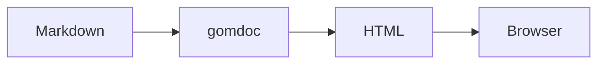

# gomdoc

A lightweight Go-based markdown documentation server that renders `.md` files as HTML with navigation, syntax highlighting, and Mermaid diagram support.

## Features

- Recursive markdown file discovery
- On-demand rendering (no temp files)
- Tree-based file index
- Navigation buttons (Back/Home)
- Internal link resolution (`.md` links automatically rewritten)
- Mermaid diagram support (client-side rendering)
- Syntax highlighting for code blocks
- GitHub Flavored Markdown (tables, strikethrough, autolinks)
- Full-text search with in-memory index
- MCP server for AI agent access (SSE on `/mcp/`)

## Installation

### Quick Install

```bash
# Install latest version
curl -fsSL https://raw.githubusercontent.com/lacrioque/gomdoc/main/install.sh | sh

# Install a specific version
curl -fsSL https://raw.githubusercontent.com/lacrioque/gomdoc/main/install.sh | sh -s -- v2.0.1

# List available versions
curl -fsSL https://raw.githubusercontent.com/lacrioque/gomdoc/main/install.sh | sh -s -- --list

# Custom install directory
INSTALL_DIR=~/.local/bin curl -fsSL https://raw.githubusercontent.com/lacrioque/gomdoc/main/install.sh | sh
```

The installer will also offer to install the `/gomdoc-setup` Claude Code skill globally, which lets you run `/gomdoc-setup docs/` in any project to configure the MCP server.

### From Source

```bash
git clone https://github.com/lacrioque/gomdoc.git
cd gomdoc
go build -o gomdoc

# Optional: Install to PATH
go install
```

### Requirements

- Quick install: `curl`, macOS (Apple Silicon) / Linux (amd64) / Windows (amd64 via MSYS/Cygwin)
- From source: Go 1.21 or later

## Usage

```bash
# Serve current directory on default port (7331)
./gomdoc

# Specify a different directory
./gomdoc -dir /path/to/docs

# Specify a custom port
./gomdoc -port 8080

# Combine options
./gomdoc -dir ./docs -port 8080

# Custom site title
./gomdoc -title "My Project Docs"

# Enable basic authentication
./gomdoc -auth admin:secret123

# Check version
./gomdoc -version
```

Then open `http://localhost:7331` in your browser.

## Command Line Options

| Flag | Default | Description |
|------|---------|-------------|
| `-port` | `7331` | Port to run the server on |
| `-dir` | `.` | Base directory to serve markdown files from |
| `-title` | `gomdoc` | Custom title for the documentation site |
| `-auth` | *(none)* | Basic auth credentials in `user:password` format |
| `-version` | | Print version and exit |

## MCP Server

The MCP server gives AI coding agents structured access to your documentation via keyword search, headline browsing, and section-level reading.

The MCP server runs automatically on `/mcp/` whenever the HTTP server is running. No extra flags needed.

```bash
gomdoc -dir /path/to/docs -port 8080
# MCP available at http://localhost:8080/mcp/
```

Add to your Claude Code settings (`.claude/settings.json`):

```json
{
  "mcpServers": {
    "docs": {
      "type": "sse",
      "url": "http://localhost:8080/mcp/"
    }
  }
}
```

Any MCP client that supports SSE transport can connect to `http://localhost:<port>/mcp/`.

### Available tools

`help`, `browse_topics`, `search_documents`, `get_outline`, `read_section`, `list_documents`, and `read_document`. See [docs/mcp-usage.md](docs/mcp-usage.md) for the full guide.

## Project Structure

```
gomdoc/
├── main.go              # Entry point and CLI handling
├── go.mod               # Go module definition
├── install.sh           # Quick install script
├── server/
│   └── server.go        # HTTP server, routing, and embedded CSS
├── scanner/
│   └── scanner.go       # File discovery and tree building
├── renderer/
│   └── renderer.go      # Markdown to HTML conversion
├── search/
│   └── search.go        # In-memory search index and keyword ranking
├── mcpserver/
│   └── mcpserver.go     # MCP server for AI agent access
└── templates/
    └── templates.go     # HTML page templates
```

## How It Works

1. **File Discovery**: On each request, gomdoc scans the base directory recursively for `.md` files
2. **Tree Building**: Files are organized into a tree structure for the index page
3. **Rendering**: Markdown is converted to HTML using [goldmark](https://github.com/yuin/goldmark) with GFM extensions
4. **Link Rewriting**: Internal `.md` links are automatically converted to server routes
5. **Mermaid**: Diagrams are rendered client-side using Mermaid.js from CDN

## Internal Links

Links to other markdown files are automatically rewritten:

| Markdown Link | Server Route |
|---------------|--------------|
| `[Link](other.md)` | `/other` |
| `[Link](./docs/file.md)` | `/docs/file` |
| `[Link](../README.md)` | `/README` |

External links (`http://`, `https://`) are preserved unchanged.

## Mermaid Diagrams

Mermaid diagrams are rendered client-side. Use fenced code blocks with `mermaid` as the language:

````markdown

```mermaid
graph LR
    A[Markdown] --> B[gomdoc]
    B --> C[HTML]
    C --> D[Browser]
```
````

Renders as:


```mermaid
graph LR
    A[Markdown] --> B[gomdoc]
    B --> C[HTML]
    C --> D[Browser]
```

## Syntax Highlighting

Code blocks with language specifiers are automatically highlighted using the Monokai theme:

````markdown
```go
func main() {
    fmt.Println("Hello, World!")
}
```
````

## Dependencies

- [goldmark](https://github.com/yuin/goldmark) - Markdown parser
- [goldmark-highlighting](https://github.com/yuin/goldmark-highlighting) - Syntax highlighting
- [Mermaid.js](https://mermaid.js.org/) - Diagram rendering (CDN)

## License

MIT
