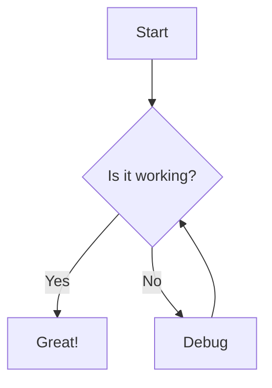

# Test Document

This is a test markdown file to verify the gomdoc functionality.

## Features

- **Bold text** and *italic text*
- [Link to README](../README.md)
- Code highlighting

## Code Example

```go
package main

import "fmt"

func main() {
    fmt.Println("Hello, World!")
}
```

## Table

| Feature | Status |
|---------|--------|
| Markdown rendering | Working |
| Code highlighting | Working |
| Navigation | Working |
| Mermaid | Working |

## Mermaid Diagram



## Blockquote

> This is a blockquote.
> It can span multiple lines.

## Checklist

- [x] Basic markdown
- [x] Code blocks
- [x] Tables
- [x] Mermaid diagrams
- [x] Internal links
